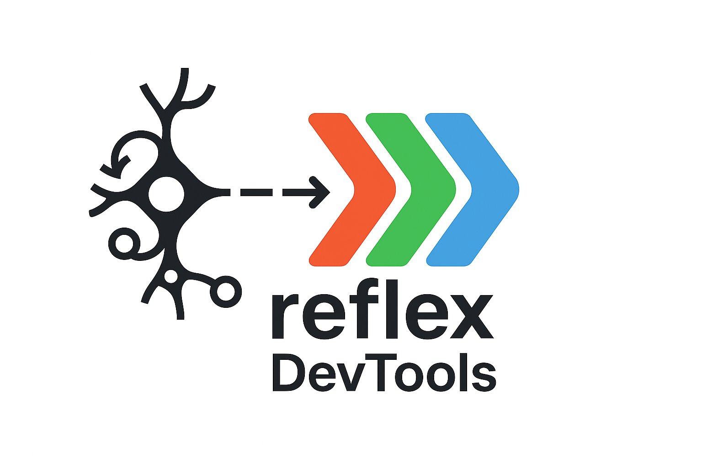
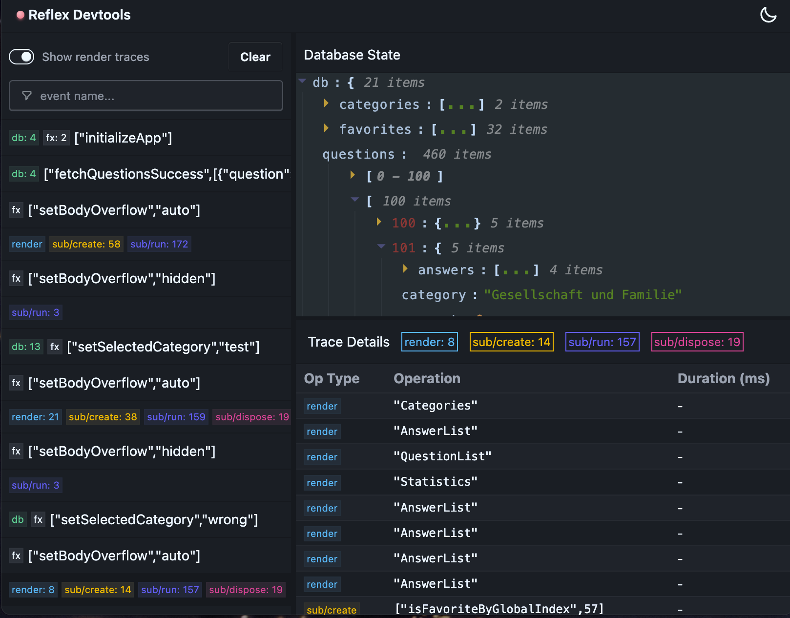

<div align="center">
  
  
  # 🛠️ Reflex DevTools
  
  **Real-time debugging and inspection for Reflex applications**
  
  [](https://opensource.org/licenses/MIT)
  [](https://www.npmjs.com/package/@flexsurfer/reflex-devtools)
  [](https://github.com/flexsurfer/reflex-devtools/pulls)
    

  
</div>

---

## ✨ What is Reflex DevTools?

Reflex DevTools is a powerful debugging toolkit for applications built with the [`@flexsurfer/reflex`](https://github.com/flexsurfer/reflex) library. It provides real-time inspection of your application's state, events, and traces through an intuitive web-based dashboard.

### 🎯 Key Features

- **📊 Database State Inspection** - Visualize your entire application state in real-time
- **🔄 Real-time Event Tracing** - Watch events and state changes as they happen
- **🔥 Real-time Reactions and Render Tracing** - Watch all reactions being created and run, and rendering processes
- **⏱ Performance Profiling** - Analyze events and reactions times and bottlenecks in real-time
- **🎨 Beautiful Dashboard** - Clean, modern UI with dark/light theme support
- **📱 React & React Native Support** - Works seamlessly with both platforms
- **⚡ Zero Configuration** - Get started with just two lines of code

---

## 🚀 Quick Start

### Installation

```bash
npm install --save-dev @flexsurfer/reflex-devtools
# or
yarn add -D @flexsurfer/reflex-devtools
# or
pnpm add -D @flexsurfer/reflex-devtools
```

### 1. Enable in Your App

Add these lines to your app's entry point (e.g., `main.tsx` or `App.tsx`):

```typescript
import { enableTracing } from '@flexsurfer/reflex';
import { enableDevtools } from '@flexsurfer/reflex-devtools';

// Enable tracing for Reflex events
enableTracing();

// Connect to devtools server
enableDevtools({ 
  serverUrl: 'localhost:4000' // Optional: defaults to localhost:4000
});
```

### 2. Start the DevTools Server

```bash
npx reflex-devtools
```

Or with custom configuration:

```bash
npx reflex-devtools --port 3000 --host 0.0.0.0
```

### 3. Open the Dashboard

Navigate to [http://localhost:4000](http://localhost:4000) in your browser to see the DevTools dashboard.

---

## 📖 Usage Examples

### Basic Setup

```typescript
// main.tsx
import React from 'react';
import ReactDOM from 'react-dom/client';
import { enableTracing } from '@flexsurfer/reflex';
import { enableDevtools } from '@flexsurfer/reflex-devtools';
import App from './App';

enableTracing();
enableDevtools();

ReactDOM.createRoot(document.getElementById('root')!).render(
  <React.StrictMode>
    <App />
  </React.StrictMode>
);
```

### Custom Configuration

```typescript
enableDevtools({
  serverUrl: 'localhost:3001',
  enabled: process.env.NODE_ENV === 'development'
});
```
---

## 🔧 Configuration Options

### Client Configuration

```typescript
interface DevtoolsConfig {
  serverUrl?: string;  // Default: 'localhost:4000'
  enabled?: boolean;   // Default: true
}
```

### Server Configuration

```bash
npx reflex-devtools [options]

Options:
  -p, --port <port>    Port number (default: 4000)
  -h, --host <host>    Host address (default: localhost)
  --help              Show help message
```

---

## 🏗️ Architecture

Reflex DevTools consists of three main components:

```
┌─────────────────┐    WebSocket/HTTP    ┌─────────────────┐
│   Your App      │ ◀──────────────────▶ │  DevTools       │
│                 │                      │  Server         │
│ - Reflex SDK    │                      │                 │
│ - DevTools SDK  │                      │ - Express API   │
│                 │                      │ - WebSocket     │
└─────────────────┘                      └─────────────────┘
                                                   │
                                                   │ HTTP
                                                   ▼
                                         ┌─────────────────┐
                                         │   Web Dashboard │
                                         │                 │
                                         │ - React UI      │
                                         │ - Real-time     │
                                         │   Updates       │
                                         └─────────────────┘
```

### Components:

1. **Client SDK** (`/client`) - Lightweight SDK that integrates with your app
2. **DevTools Server** (`/server`) - Express server with WebSocket support
3. **Web Dashboard** (`/ui`) - React-based debugging interface

---

## 🛠️ Development & Contributing

We welcome contributions! Here's how to get started:

### Prerequisites

- Node.js 18+ 
- pnpm (recommended) or npm/yarn

### Setup Development Environment

```bash
# Clone the repository
git clone https://github.com/flexsurfer/reflex-devtools.git
cd reflex-devtools

# Install dependencies
pnpm install

# Start development servers
pnpm dev
```

This will start:
- DevTools server on `localhost:4000`
- UI development server with hot reload on `localhost:5173`
- Test app on `localhost:3000`

### Project Structure

```
packages/
├── reflex-devtools/     # Main package (client SDK + server)
│   ├── src/client/      # Client SDK for apps
│   ├── src/server/      # DevTools server
│   └── src/cli.ts       # CLI entry point
├── reflex-devtool-ui/   # Web dashboard
│   └── src/            # React components
└── reflex-test-app/     # Example app for testing
```

### Development Commands

```bash
# Build all packages
pnpm build

# Run tests
pnpm test

# Start only the UI in development
pnpm dev:ui

# Start only the server
pnpm dev:server

# Start only the test app
pnpm dev:testapp

# Clean all builds
pnpm clean
```

### Making Changes

1. **Fork** the repository
2. **Create** a feature branch: `git checkout -b feature/amazing-feature`
3. **Make** your changes
4. **Test** with the test app: `pnpm dev:testapp`
5. **Commit** using conventional commits: `git commit -m 'feat: add amazing feature'`
6. **Push** and create a **Pull Request**

### Code Style

- TypeScript for all code
- ESLint + Prettier for formatting
- Conventional Commits for commit messages
- Component-based architecture for UI

---

## 📄 License

MIT License - see [LICENSE](LICENSE) file for details.

---

## 🙏 Acknowledgments

Built with ❤️ for the Reflex community. Special thanks to all contributors and the open-source projects that make this possible.

---

<div align="center">
  
  **Happy Debugging! 🐛➡️✨**
  
  Made by [@flexsurfer](https://github.com/flexsurfer)
  
</div>